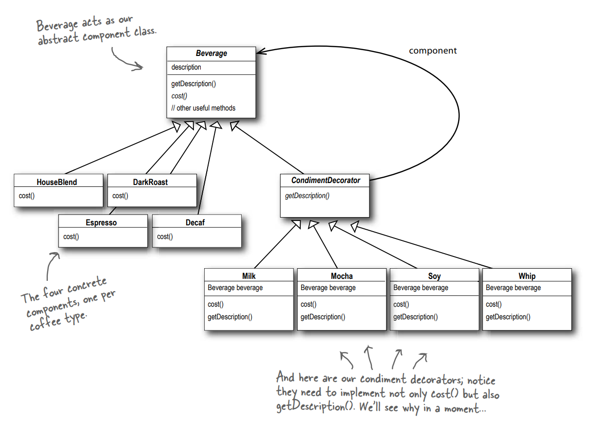

# Decorator Pattern

This is a simple c++ sample code with decorator pattern for the starbuzz case of book [Head First Design Patterns](https://www.oreilly.com/library/view/head-first-design/9781492077992/) 

## Inheritance tree
<!--  -->

## What it fits
"Classes should be open for extension but closed for modification." Open-closed principle.

- We need to provide some alternatives for subclasses to extend their behaviors. But, perhaps, without the need to modify the existing code.
- A set of decorators should be used to wrap concrete components. 
- You want to change the behavior of existing components, by adding new functionality.

Also, in some cases, decorator pattern is somehow costly and not efficient. For more efficient implementation of getting the price in starbuzz, I may consider using vectors to store the components, and a mask array to indicate which components and how many of them are used.   